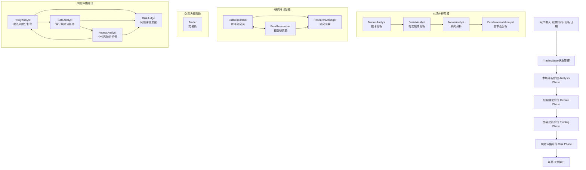

# TradeAgent开发实践分享

## 项目概述

CortexGo是基于CloudWeGo Eino框架实现的多智能体交易决策系统，通过多个专业化Agent的协作完成股票交易分析和决策。该项目采用现代化的Agent编排模式，实现了从市场分析到最终交易决策的完整workflow。

## 系统架构设计

### 整体架构图



### 核心技术栈

- **框架**: CloudWeGo Eino v0.4.4 (Go语言Agent编排框架)
- **状态管理**: 集中式TradingState状态管理
- **消息传递**: Eino Schema Message系统
- **LLM集成**: OpenAI/DeepSeek API集成
- **工具调用**: 外部数据源工具集成(Reddit、Google News、Market Data)

## Agent架构设计

### 1. Agent节点设计模式

每个Agent都采用统一的三层架构：

```go
type AgentNode struct {
    Load   // 消息加载层：构建prompt和上下文
    Agent  // 核心处理层：LLM推理和决策
    Router // 路由控制层：决定下一步流转
}
```

### 2. 状态管理核心

```go
type TradingState struct {
    // 基础信息
    Messages          []*schema.Message // 消息历史
    CompanyOfInterest string           // 目标股票
    TradeDate         string           // 交易日期

    // 分析报告
    MarketReport       string // 市场技术分析
    SocialReport       string // 社交媒体分析
    NewsReport         string // 新闻分析
    FundamentalsReport string // 基本面分析

    // 辩论状态
    InvestmentDebateState *InvestDebateState // 投资辩论状态
    RiskDebateState       *RiskDebateState   // 风险辩论状态

    // 决策流程控制
    Phase             string // 当前阶段
    Goto              string // 下一步路由
    WorkflowComplete  bool   // 流程完成标志

    // 历史决策记忆
    PreviousDecisions []TradingDecision // 历史决策用于学习
}
```

## 各Agent实现详解与Prompt工程

### 1. 市场分析Agent (MarketAnalyst)

**职责**: 进行技术分析，获取市场数据和技术指标

**实现特点**:
- 采用ReAct模式，支持工具调用
- 集成市场数据API获取实时数据
- 生成技术分析报告

**核心代码**:
```go
func loadMarketAnalystMessages(ctx context.Context, name string, opts ...any) {
    // 1. 加载系统提示词
    systemPrompt, _ := utils.LoadPrompt("analysts/market_analyst")

    // 2. 构建用户查询
    userMessage := fmt.Sprintf("分析%s在%s的技术指标",
        state.CompanyOfInterest, state.TradeDate)

    // 3. 返回消息序列
    return []*schema.Message{
        schema.SystemMessage(systemPrompt),
        schema.UserMessage(userMessage),
    }
}
```

### 2. 研究辩论Agent (Bull/Bear Researcher)

**职责**: 通过多轮辩论形成投资观点

**辩论机制**:
- BullResearcher和BearResearcher轮流发言
- 每轮辩论更新辩论历史并自动保存报告
- 达到2轮后由ResearchManager总结

#### Bull Researcher 核心Prompt设计

**角色定位**: 看涨分析师，为投资该股票构建强有力的证据支持

**关键Prompt要素**:
```markdown
You are a Bull Analyst advocating for investing in the stock.
Key points to focus on:
- Growth Potential: 突出公司市场机会、收入预测和可扩展性
- Competitive Advantages: 强调独特产品、强大品牌或主导市场地位
- Positive Indicators: 使用财务健康、行业趋势和最新正面消息作为证据
- Bear Counterpoints: 用具体数据和合理推理批判性分析空头论证
- Engagement: 以对话风格呈现论证，直接回应空头分析师观点
```

**实现要点**:
```go
func bullResearcherRouter(ctx context.Context, input *schema.Message, opts ...any) {
    return compose.ProcessState[*models.TradingState](ctx, func(state *TradingState) error {
        if input != nil && state.InvestmentDebateState != nil {
            // 规范化参数处理
            argument := strings.TrimSpace(input.Content)
            if argument == "" {
                argument = "(no argument provided)"
            }
            labeledArgument := "Bull Analyst: " + argument

            // 更新辩论状态
            investmentDebateState.History += "\n" + labeledArgument
            investmentDebateState.BullHistory += "\n" + labeledArgument
            investmentDebateState.Count++

            // 自动保存报告到文件系统
            filePath := fmt.Sprintf("results/%s/%s", state.CompanyOfInterest, state.TradeDate)
            utils.WriteMarkdown(filePath, "bull_researcher_report.md", labeledArgument)
        }

        // 条件路由：2轮后结束辩论
        if state.InvestmentDebateState.Count >= 2 {
            state.Goto = consts.ResearchManager
        } else {
            state.Goto = consts.BearResearcher
        }
        return nil
    })
}
```

#### Bear Researcher 核心Prompt设计

**角色定位**: 看跌分析师，反对投资该股票并强调风险挑战

**关键Prompt要素**:
```markdown
You are a Bear Analyst making the case against investing in the stock.
Key points to focus on:
- Risks and Challenges: 突出市场饱和、财务不稳定或宏观经济威胁
- Competitive Weaknesses: 强调市场定位弱化、创新下降或竞争对手威胁
- Negative Indicators: 使用财务数据、市场趋势或不利消息支持立场
- Bull Counterpoints: 批判性分析多头论证，暴露弱点或过度乐观假设
- Engagement: 直接回应多头分析师观点并有效辩论
```

**实现亮点**:
```go
func bearResearcherRouter(ctx context.Context, input *schema.Message, opts ...any) {
    // 支持工具调用和直接内容两种输入方式
    if len(input.ToolCalls) > 0 && input.ToolCalls[0].Function.Name == "submit_bear_research" {
        // 解析工具调用参数
        argMap := map[string]any{}
        json.Unmarshal([]byte(input.ToolCalls[0].Function.Arguments), &argMap)
        if research, ok := argMap["research"].(string); ok {
            argument = strings.TrimSpace(research)
        }
    }

    // 统一的状态更新和文件保存逻辑
    labeledArgument := "Bear Analyst: " + argument
    utils.WriteMarkdown(filePath, "bear_researcher_report.md", labeledArgument)
}
```

### 3. 研究总监Agent (Research Manager)

**职责**: 综合多空辩论，制定最终投资计划

**Prompt设计核心**:
```markdown
作为投资组合经理和辩论主持人，你的角色是：
- 批判性评估辩论轮次并做出明确决策：看涨、看跌或持有
- 简明总结双方关键观点，专注于最有说服力的证据
- 避免默认持有立场，要基于辩论中最强论证做出承诺性决策
- 制定详细投资计划包括：推荐理由、战略行动步骤
- 利用过往错误反思改进决策
```

**实现要点**:
```go
func researchManagerRouter(ctx context.Context, input *schema.Message, opts ...any) {
    if input != nil && state.InvestmentDebateState != nil {
        // 设置最终决策和投资计划
        investmentDebateState.JudgeDecision = input.Content
        state.InvestmentPlan = input.Content

        // 保存研究总监报告
        utils.WriteMarkdown(filePath, "research_manager_report.md", input.Content)

        // 标记辩论阶段完成，转入交易阶段
        state.DebatePhaseComplete = true
        state.Phase = "trading"
    }
    state.Goto = consts.Trader
}
```

### 4. 交易员Agent (Trader)

**职责**: 基于投资计划制定具体交易决策

**Prompt设计要点**:
```markdown
You are a trading agent analyzing market data to make investment decisions.
- 基于分析提供买入、卖出或持有的具体建议
- 必须以"FINAL TRANSACTION PROPOSAL: **BUY/HOLD/SELL**"结束
- 利用过往决策教训避免重复错误
- 输出内容使用中文
```

**实现特色**:
```go
func loadTraderMessages(ctx context.Context, name string, opts ...any) {
    // 整合历史决策记忆用于学习
    pastMemoryStr := ""
    for i, decision := range state.PreviousDecisions {
        pastMemoryStr += fmt.Sprintf("Decision %d: %+v\n", i+1, decision)
    }

    // 动态替换prompt中的历史记忆占位符
    systemPromptWithContext := strings.ReplaceAll(systemPrompt, "{past_memory_str}", pastMemoryStr)

    // 构建包含投资计划的用户消息，要求中文输出
    userContextMessage := fmt.Sprintf(`基于分析团队的综合分析，这里是为%s量身定制的投资计划...
    The output content should be in Chinese.`,
        state.CompanyOfInterest, state.InvestmentPlan)
}
```

### 5. 风险管理Agent (三方辩论模式)

**职责**: 三方风险评估和最终风险判断

#### Risky Analyst (激进风险分析师)

**角色设计**: 积极倡导高回报高风险机会
```markdown
作为激进风险分析师：
- 专注潜在上升空间、增长潜力和创新收益
- 即使伴随风险也要强调大胆策略和竞争优势
- 用数据驱动的反驳质疑保守和中性分析师观点
- 突出他们的谨慎可能错失的关键机会
- 积极辩论证明高回报视角提供最佳前进道路
```

#### Safe Analyst (保守风险分析师)

**角色设计**: 优先保护资产，确保稳定可靠增长
```markdown
作为保守风险分析师：
- 优先考虑稳定性、安全性和风险缓解
- 仔细评估潜在损失、经济衰退和市场波动
- 批判性审查高风险要素，指出可能的过度风险敞口
- 积极反驳激进和中性分析师论点
- 强调低风险方法对公司资产的最终安全性
```

#### Risk Judge (风险评估总监)

**最终决策者**: 综合三方观点做出最终风险评估和交易批准

**评估流程**:
1. 三个风险分析师轮流发表观点并相互辩论
2. 每轮更新各自的风险评估历史
3. 达到最大轮次后由RiskJudge综合评估做最终决策

## 工作流编排实现

### 1. Graph构建

```go
func NewTradingOrchestrator() compose.Runnable {
    g := compose.NewGraph()

    // 顺序分析阶段
    g.AddEdge(START, MarketAnalyst)
    g.AddEdge(MarketAnalyst, SocialAnalyst)
    g.AddEdge(SocialAnalyst, NewsAnalyst)
    g.AddEdge(NewsAnalyst, FundamentalsAnalyst)
    g.AddEdge(FundamentalsAnalyst, BullResearcher)

    // 条件分支辩论阶段
    g.AddBranch(BullResearcher, ShouldContinueDebate, {
        BearResearcher: true,
        ResearchManager: true,
    })

    // 风险评估阶段循环
    g.AddBranch(RiskyAnalyst, ShouldContinueRiskAnalysis, {
        SafeAnalyst: true,
        RiskJudge: true,
    })

    return g.Compile()
}
```

### 2. 条件控制逻辑

```go
func ShouldContinueDebate(ctx context.Context, state *TradingState) string {
    if state.InvestmentDebateState.Count >= MaxDebateRounds*2 {
        return ResearchManager // 结束辩论
    }
    return BearResearcher // 继续辩论
}
```

## 核心技术特点与Prompt工程最佳实践

### 1. 状态驱动的工作流

- **集中式状态管理**: 所有Agent共享TradingState
- **阶段式处理**: analysis → debate → trading → risk
- **历史记忆**: 保存历史决策用于学习改进
- **自动化报告**: 每个Agent自动保存分析报告到文件系统

### 2. Prompt工程核心设计模式

#### 角色驱动设计
每个Agent都有明确的角色定义和职责边界：
```go
// 外部化Prompt管理
systemPrompt, _ := utils.LoadPrompt("trader/trader")

// 动态上下文注入
systemPromptWithContext := strings.ReplaceAll(systemPrompt, "{past_memory_str}", pastMemoryStr)
```

#### 上下文感知机制
```go
// 多维度上下文整合
context := map[string]any{
    "market_research_report": state.MarketReport,
    "social_media_report":    state.SocialReport,
    "news_report":            state.NewsReport,
    "fundamentals_report":    state.FundamentalsReport,
    "history":                history,
    "current_response":       currentResponse,
    "past_memory_str":        pastMemoryStr,
}
```

#### 输出格式控制
- **结构化输出**: 交易员必须以固定格式结束决策
- **语言控制**: 统一使用中文输出增强一致性
- **辩论风格**: 鼓励对话式而非列举式的论证

### 3. 模块化Agent设计

- **统一接口**: 每个Agent都实现load-agent-router模式
- **独立职责**: 每个Agent专注特定分析维度
- **智能路由**: 基于辩论轮次和状态的条件路由控制
- **可扩展性**: 易于添加新的分析Agent

### 4. 工具集成能力

```go
// 工具定义示例
var MarketDataTool = &schema.ToolInfo{
    Name: "get_market_data",
    Desc: "获取股票市场数据",
    ParamsOneOf: schema.NewParamsOneOfByParams(/*参数定义*/),
}

// Agent中绑定工具
func NewMarketAnalyst() {
    return agents.ChatModel.BindTools(MarketDataTool)
}
```

### 5. 条件分支控制与辩论机制

#### 双方辩论控制
```go
// Bull/Bear辩论轮次控制
if state.InvestmentDebateState.Count >= 2 {
    state.Goto = consts.ResearchManager  // 结束辩论
} else {
    state.Goto = consts.BearResearcher   // 继续辩论
}
```

#### 三方风险辩论
- **循环辩论**: Risky → Safe → Neutral → Risky
- **观点对抗**: 每个Agent都要反驳其他两方观点
- **数据支撑**: 要求用具体数据支持论证而非空洞观点

#### 阶段管理机制
```go
// 阶段状态跟踪
state.Phase = "trading"
state.TradingPhaseComplete = true

// 自动阶段转换
if state.DebatePhaseComplete {
    state.Goto = consts.Trader
}
```

## 项目实战经验与Prompt工程心得

### 1. 状态管理最佳实践

- **状态不可变**: 通过ProcessState确保状态安全修改
- **阶段明确**: 每个阶段都有明确的完成标识
- **历史追踪**: 保存决策历史用于反思和学习
- **自动持久化**: 每个Agent决策自动保存到结构化文件

### 2. Prompt工程核心技巧

#### 外部化管理策略
```go
// 所有prompt存储在markdown文件中便于迭代优化
systemPrompt, _ := utils.LoadPrompt("trader/trader")
bullPrompt, _ := utils.LoadPrompt("researchers/bull_researcher")
```

#### 动态上下文注入
```go
// 多层次上下文整合
context := map[string]any{
    "market_research_report": state.MarketReport,    // 技术分析
    "social_media_report":    state.SocialReport,    // 情绪分析
    "news_report":            state.NewsReport,      // 新闻事件
    "fundamentals_report":    state.FundamentalsReport, // 基本面
    "history":                debateHistory,         // 辩论历史
    "past_memory_str":        pastDecisions,        // 历史决策
}
```

#### 角色驱动设计模式
每个Agent都有明确的角色persona和行为模式：
- **Bull Analyst**: 积极寻找投资机会，用数据反驳空头观点
- **Bear Analyst**: 专注风险识别，暴露多头论证弱点
- **Research Manager**: 决策导向，避免中庸立场
- **Trader**: 行动导向，必须给出明确BUY/SELL/HOLD决策

#### 输出质量控制
```go
// 格式约束
userMessage += "\nThe output content should be in Chinese."
// 结构化要求
"必须以'FINAL TRANSACTION PROPOSAL: **BUY/HOLD/SELL**'结束"
// 风格指导
"以对话风格呈现论证，直接回应对方观点并有效辩论"
```

### 3. 辩论机制设计精髓

#### 对抗性促进质量
- **强制立场**: 每个Agent必须有明确立场而非中庸观点
- **相互反驳**: 要求直接回应对方论证而非独立陈述
- **证据要求**: 强调用具体数据支持观点而非空洞理论

#### 轮次控制策略
```go
// 简化的2轮辩论避免冗长讨论
if state.InvestmentDebateState.Count >= 2 {
    return consts.ResearchManager
}

// 灵活的三方风险辩论
next := map[string]string{
    consts.RiskyAnalyst:   consts.SafeAnalyst,
    consts.SafeAnalyst:    consts.NeutralAnalyst,
    consts.NeutralAnalyst: consts.RiskyAnalyst,
}[currentAgent]
```

### 4. 性能优化与监控

#### 并行处理潜力
- **分析阶段**: MarketAnalyst、SocialAnalyst、NewsAnalyst可并行
- **数据获取**: 多个数据源API调用可异步处理
- **报告生成**: 文件写入操作可异步化

#### 缓存策略
```go
// 市场数据缓存避免重复API调用
marketData := cache.GetOrFetch(symbol, date, fetchMarketData)

// Prompt模板缓存减少文件I/O
promptCache := sync.Map{}
```

#### 错误处理与监控
```go
// Agent执行监控
type LoggerCallback struct {
    Out chan string
}

func (l *LoggerCallback) OnNodeStart(ctx context.Context, info *compose.CallbackInfo) {
    l.Out <- fmt.Sprintf("开始执行: %s\n", info.Node)
}

// 报告写入错误处理
if err := utils.WriteMarkdown(filePath, fileName, content); err != nil {
    log.Printf("Failed to write %s report: %v", agentName, err)
}
```

## 部署和运行

### 1. 环境配置

```bash
# 环境变量设置
export OPENAI_API_KEY="your-api-key"
export DEEPSEEK_API_KEY="your-deepseek-key"

# 编译运行
go build -o cortexgo cmd/main.go
./cortexgo
```

### 2. 批量分析模式

```bash
# 批量分析多个股票
./cortexgo batch analyze --symbols AAPL,TSLA,NVDA --date 2024-03-15
```

### 3. 配置参数

```go
type Config struct {
    MaxDebateRounds     int    // 最大辩论轮次
    MaxRiskRounds       int    // 最大风险评估轮次
    APITimeout          int    // API超时时间
    ModelName           string // 使用的LLM模型
    EnableMemory        bool   // 是否启用历史记忆
}
```

## 扩展和优化方向

### 1. 短期优化

- **工具丰富化**: 集成更多数据源(财报、期权数据等)
- **记忆系统**: 实现向量数据库存储历史决策
- **并行优化**: 分析阶段Agent并行执行

### 2. 长期演进

- **强化学习**: 基于交易结果的Agent学习优化
- **实时决策**: 支持实时市场数据流处理
- **风控增强**: 更精细的风险管理和头寸控制

### 3. 架构扩展

- **微服务化**: Agent独立服务化部署
- **分布式执行**: 支持大规模股票池分析
- **可视化界面**: 决策过程可视化展示

## 总结

CortexGo项目展示了现代Agent编排框架在金融决策场景的应用实践：

1. **架构清晰**: 基于Eino框架的标准化Agent设计
2. **职责分离**: 每个Agent专注特定分析维度
3. **状态驱动**: 集中式状态管理保证数据一致性
4. **可扩展性**: 模块化设计易于功能扩展
5. **工程实践**: 完整的错误处理、日志监控和配置管理

该项目为构建复杂的多Agent协作系统提供了有价值的参考模式，特别是在需要多轮交互、条件分支和状态管理的场景中。