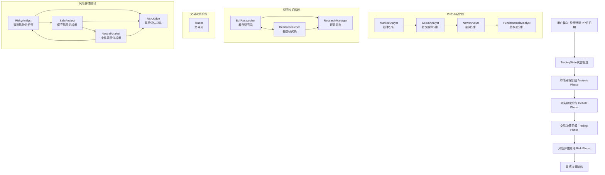

# TradeAgent开发实践分享

## 项目概述

CortexGo是基于CloudWeGo Eino框架实现的多智能体交易决策系统，通过多个专业化Agent的协作完成股票交易分析和决策。该项目采用现代化的Agent编排模式，实现了从市场分析到最终交易决策的完整workflow。

## 系统架构设计

### 整体架构图



### 核心技术栈

- **框架**: CloudWeGo Eino v0.4.4 (Go语言Agent编排框架)
- **状态管理**: 集中式TradingState状态管理
- **消息传递**: Eino Schema Message系统
- **LLM集成**: OpenAI/DeepSeek API集成
- **工具调用**: 外部数据源工具集成(Reddit、Google News、Market Data)

## Agent架构设计

### 1. Agent节点设计模式

每个Agent都采用统一的三层架构：

```go
type AgentNode struct {
    Load   // 消息加载层：构建prompt和上下文
    Agent  // 核心处理层：LLM推理和决策
    Router // 路由控制层：决定下一步流转
}
```

### 2. 状态管理核心

```go
type TradingState struct {
    // 基础信息
    Messages          []*schema.Message // 消息历史
    CompanyOfInterest string           // 目标股票
    TradeDate         string           // 交易日期

    // 分析报告
    MarketReport       string // 市场技术分析
    SocialReport       string // 社交媒体分析
    NewsReport         string // 新闻分析
    FundamentalsReport string // 基本面分析

    // 辩论状态
    InvestmentDebateState *InvestDebateState // 投资辩论状态
    RiskDebateState       *RiskDebateState   // 风险辩论状态

    // 决策流程控制
    Phase             string // 当前阶段
    Goto              string // 下一步路由
    WorkflowComplete  bool   // 流程完成标志

    // 历史决策记忆
    PreviousDecisions []TradingDecision // 历史决策用于学习
}
```

## 各Agent实现详解

### 1. 市场分析Agent (MarketAnalyst)

**职责**: 进行技术分析，获取市场数据和技术指标

**实现特点**:
- 采用ReAct模式，支持工具调用
- 集成市场数据API获取实时数据
- 生成技术分析报告

**核心代码**:
```go
func loadMarketAnalystMessages(ctx context.Context, name string, opts ...any) {
    // 1. 加载系统提示词
    systemPrompt, _ := utils.LoadPrompt("analysts/market_analyst")

    // 2. 构建用户查询
    userMessage := fmt.Sprintf("分析%s在%s的技术指标",
        state.CompanyOfInterest, state.TradeDate)

    // 3. 返回消息序列
    return []*schema.Message{
        schema.SystemMessage(systemPrompt),
        schema.UserMessage(userMessage),
    }
}
```

### 2. 研究辩论Agent (Bull/Bear Researcher)

**职责**: 通过多轮辩论形成投资观点

**辩论机制**:
- BullResearcher和BearResearcher轮流发言
- 每轮辩论更新辩论历史
- 达到最大轮次后由ResearchManager总结

**核心逻辑**:
```go
func bullResearcherRouter(ctx context.Context, input *schema.Message, opts ...any) {
    return compose.ProcessState[*models.TradingState](ctx, func(state *TradingState) error {
        // 更新辩论状态
        argument := "Bull Analyst: " + input.Content
        state.InvestmentDebateState.History += "\n" + argument
        state.InvestmentDebateState.BullHistory += "\n" + argument
        state.InvestmentDebateState.Count += 1

        // 根据轮次决定下一步
        // 由条件逻辑控制是否继续辩论或结束
        return nil
    })
}
```

### 3. 交易员Agent (Trader)

**职责**: 基于前期分析制定具体交易计划

**决策依据**:
- 综合市场分析报告
- 社交媒体情绪分析
- 新闻事件影响
- 基本面分析结果
- 研究团队辩论结论

**实现要点**:
```go
func loadTraderMessages(ctx context.Context, name string, opts ...any) {
    // 1. 整合历史决策记忆
    pastMemoryStr := ""
    for i, decision := range state.PreviousDecisions {
        pastMemoryStr += fmt.Sprintf("Decision %d: %+v\n", i+1, decision)
    }

    // 2. 构建当前情况描述
    userContextMessage := fmt.Sprintf(
        "基于分析团队的综合分析，为%s制定投资计划。投资计划：%s",
        state.CompanyOfInterest, state.InvestmentPlan)

    return messages
}
```

### 4. 风险管理Agent (Risk Analysts)

**职责**: 三方风险评估和最终风险判断

**三方角色**:
- RiskyAnalyst: 激进风险偏好，关注收益机会
- SafeAnalyst: 保守风险偏好，关注下行风险
- NeutralAnalyst: 中性风险偏好，平衡收益风险

**评估流程**:
1. 三个风险分析师轮流发表观点
2. 每轮更新各自的风险评估历史
3. 达到最大轮次后由RiskJudge做最终决策

## 工作流编排实现

### 1. Graph构建

```go
func NewTradingOrchestrator() compose.Runnable {
    g := compose.NewGraph()

    // 顺序分析阶段
    g.AddEdge(START, MarketAnalyst)
    g.AddEdge(MarketAnalyst, SocialAnalyst)
    g.AddEdge(SocialAnalyst, NewsAnalyst)
    g.AddEdge(NewsAnalyst, FundamentalsAnalyst)
    g.AddEdge(FundamentalsAnalyst, BullResearcher)

    // 条件分支辩论阶段
    g.AddBranch(BullResearcher, ShouldContinueDebate, {
        BearResearcher: true,
        ResearchManager: true,
    })

    // 风险评估阶段循环
    g.AddBranch(RiskyAnalyst, ShouldContinueRiskAnalysis, {
        SafeAnalyst: true,
        RiskJudge: true,
    })

    return g.Compile()
}
```

### 2. 条件控制逻辑

```go
func ShouldContinueDebate(ctx context.Context, state *TradingState) string {
    if state.InvestmentDebateState.Count >= MaxDebateRounds*2 {
        return ResearchManager // 结束辩论
    }
    return BearResearcher // 继续辩论
}
```

## 核心技术特点

### 1. 状态驱动的工作流

- **集中式状态管理**: 所有Agent共享TradingState
- **阶段式处理**: analysis → debate → trading → risk
- **历史记忆**: 保存历史决策用于学习改进

### 2. 模块化Agent设计

- **统一接口**: 每个Agent都实现load-agent-router模式
- **独立职责**: 每个Agent专注特定分析维度
- **可扩展性**: 易于添加新的分析Agent

### 3. 工具集成能力

```go
// 工具定义示例
var MarketDataTool = &schema.ToolInfo{
    Name: "get_market_data",
    Desc: "获取股票市场数据",
    ParamsOneOf: schema.NewParamsOneOfByParams(/*参数定义*/),
}

// Agent中绑定工具
func NewMarketAnalyst() {
    return agents.ChatModel.BindTools(MarketDataTool)
}
```

### 4. 条件分支控制

- **动态路由**: 基于状态和业务逻辑的智能路由
- **循环控制**: 支持多轮辩论和讨论
- **阶段管理**: 清晰的阶段划分和流程控制

## 项目实战经验

### 1. 状态管理最佳实践

- **状态不可变**: 通过ProcessState确保状态安全修改
- **阶段明确**: 每个阶段都有明确的完成标识
- **历史追踪**: 保存决策历史用于反思和学习

### 2. Prompt工程技巧

- **外部化管理**: 提示词存储在markdown文件中
- **上下文注入**: 动态注入历史记忆和当前状态
- **角色明确**: 每个Agent都有明确的角色定义

### 3. 性能优化考虑

- **并行处理**: 分析阶段可考虑并行执行
- **缓存机制**: 市场数据和新闻可实现缓存
- **资源控制**: 通过配置控制最大轮次和超时

### 4. 错误处理和监控

```go
// 日志回调
type LoggerCallback struct {
    Out chan string
}

func (l *LoggerCallback) OnNodeStart(ctx context.Context, info *compose.CallbackInfo) {
    l.Out <- fmt.Sprintf("开始执行: %s\n", info.Node)
}
```

## 部署和运行

### 1. 环境配置

```bash
# 环境变量设置
export OPENAI_API_KEY="your-api-key"
export DEEPSEEK_API_KEY="your-deepseek-key"

# 编译运行
go build -o cortexgo cmd/main.go
./cortexgo
```

### 2. 批量分析模式

```bash
# 批量分析多个股票
./cortexgo batch analyze --symbols AAPL,TSLA,NVDA --date 2024-03-15
```

### 3. 配置参数

```go
type Config struct {
    MaxDebateRounds     int    // 最大辩论轮次
    MaxRiskRounds       int    // 最大风险评估轮次
    APITimeout          int    // API超时时间
    ModelName           string // 使用的LLM模型
    EnableMemory        bool   // 是否启用历史记忆
}
```

## 扩展和优化方向

### 1. 短期优化

- **工具丰富化**: 集成更多数据源(财报、期权数据等)
- **记忆系统**: 实现向量数据库存储历史决策
- **并行优化**: 分析阶段Agent并行执行

### 2. 长期演进

- **强化学习**: 基于交易结果的Agent学习优化
- **实时决策**: 支持实时市场数据流处理
- **风控增强**: 更精细的风险管理和头寸控制

### 3. 架构扩展

- **微服务化**: Agent独立服务化部署
- **分布式执行**: 支持大规模股票池分析
- **可视化界面**: 决策过程可视化展示

## 总结

CortexGo项目展示了现代Agent编排框架在金融决策场景的应用实践：

1. **架构清晰**: 基于Eino框架的标准化Agent设计
2. **职责分离**: 每个Agent专注特定分析维度
3. **状态驱动**: 集中式状态管理保证数据一致性
4. **可扩展性**: 模块化设计易于功能扩展
5. **工程实践**: 完整的错误处理、日志监控和配置管理

该项目为构建复杂的多Agent协作系统提供了有价值的参考模式，特别是在需要多轮交互、条件分支和状态管理的场景中。