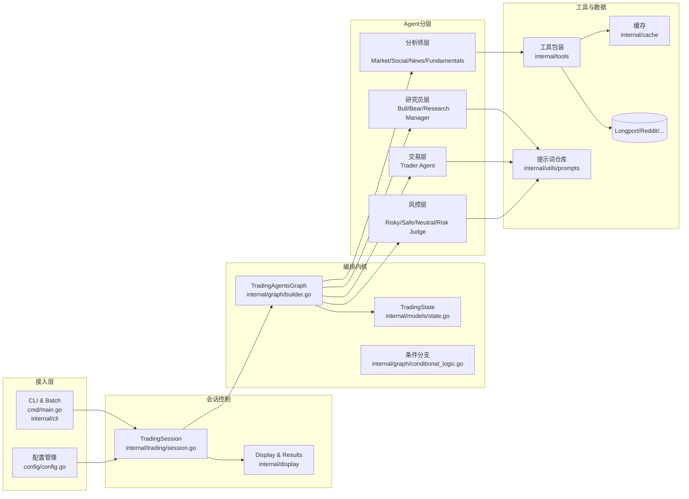
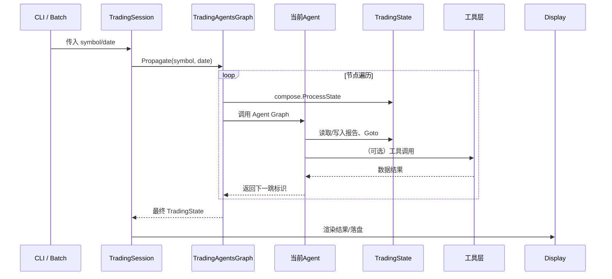

# TradeAgent开发实践分享（1小时版）

## 分享目标与大纲
| 时间 | 模块 | 关键要点 |
| --- | --- | --- |
| 0-5 分钟 | 背景与目标 | 为什么需要多智能体交易分析、CortexGo 的设计初衷 |
| 5-15 分钟 | 平台全景 | 架构层级、运行入口、状态管理策略 |
| 15-35 分钟 | 四个阶段拆解 | 分析 → 辩论 → 交易 → 风控，逐个 Agent 讲解与代码定位 |
| 35-45 分钟 | 数据与工具链 | 行情、指标、舆情工具接入方案与缓存设计 |
| 45-55 分钟 | 运营与扩展 | 配置、调试、监控、二次开发思路 |
| 55-60 分钟 | Q&A / Demo | 现场演示 `cortexgo analyze` / 讨论演进路线 |

- 目标：帮助听众既能跑通项目，也能理解各子模块的协同逻辑，为后续定制化开发打基础。
- 分享产出：一套可以复用的“TradeAgent”工作流分享模板、关键代码索引、扩展建议。

## 平台全景

- CLI 负责解析命令、加载配置并驱动 `TradingSession.Execute`（`internal/cli/commands.go:198`）。
- `TradingSession` 校验参数、初始化编排图、执行传导并输出结果（`internal/trading/session.go:35`）。
- `TradingAgentsGraph` 定义完整状态机，`TradingState` 作为唯一事实来源贯穿所有 Agent（`internal/graph/builder.go:16`, `internal/models/state.go:34`）。
- 工具层统一通过 `internal/tools` 暴露，结合缓存与提示词模板，给 Agent 提供外部知识。

## 执行流程鸟瞰

关键运行特性：
- 所有节点通过 `compose.ProcessState` 操作同一 `TradingState` 实例，避免显式锁管理。
- 条件节点以回调读取状态字段决定分支，实现“多轮辩论/风控”循环。
- Agent Graph 支持串流模式（ReAct+工具调用），通过 `StreamToolCallChecker` 观测工具事件（`internal/agents/agent_utils.go:29`）。

## 核心模块速览
| 模块 | 说明 | 关键文件 |
| --- | --- | --- |
| CLI & Config | 命令行入口、配置校验、进度展示 | `cmd/main.go`, `internal/cli/commands.go`, `config/config.go` |
| 会话管理 | 负责参数校验、编排初始化、执行结果展示 | `internal/trading/session.go`, `internal/display/display.go` |
| 编排图 | 定义节点、分支、循环与全局状态 | `internal/graph/builder.go`, `internal/graph/conditional_logic.go` |
| 分析阶段 | 市场/社交/新闻/基本面分析，部分使用 ReAct Agent+工具 | `internal/agents/analysts/*.go` |
| 投研辩论 | Bull/Bear 交替输出、研究经理收敛策略 | `internal/agents/researchers/*.go`, `internal/agents/managers/research_manager.go` |
| 交易阶段 | 交易员基于历史记忆生成执行计划 | `internal/agents/trader/trader.go` |
| 风控阶段 | 三种风险偏好辩论 + 风控经理裁决 | `internal/agents/risk_mgmt/*.go`, `internal/agents/managers/risk_manager.go` |
| 工具与缓存 | 行情、指标、舆情工具及双层缓存 | `internal/tools/*.go`, `internal/cache/market_cache.go` |

---

## 1. CLI 与会话控制
### 1.1 命令体系
- `cortexgo analyze AAPL --date=2024-03-15`：单标的分析；默认先执行强化版 `AnalysisSession`，再调用多 Agent 流程（`internal/cli/commands.go:200`）。
- `cortexgo batch`：批量处理多个标的；适合在分享演示时提前生成结果。
- `cortexgo config` 子命令：展示、校验、导入导出配置，帮助听众理解依赖项。

### 1.2 配置加载
- `config/config.go:49` 给出默认值，并允许通过 `.env`/环境变量覆盖，便于环境切换。
- 关键配置：
  - `LLMProvider` / `DeepSeekAPIKey` 控制模型来源。
  - `MaxDebateRounds` / `MaxRiskDiscussRounds` 影响循环次数，可在分享中演示调节对流程的影响。
  - `OnlineTools` / `CacheEnabled` 控制工具调用策略，便于离线演示。

### 1.3 TradingSession 生命周期
- 参数校验 → 配置验证 → 图初始化 → 运行 → 结果展示。
- `initializeGraph`/`runWithRecovery` 对 panic 做恢复，保证 CLI 体验（`internal/trading/session.go:84`）。
- `displayResults` 将状态渲染为可读摘要，可在分享中实时滚屏展示（`internal/display/display.go:26`）。

## 2. 编排图与状态机
### 2.1 TradingState 设计
- `TradingState` 承载所有上下文（`internal/models/state.go:34`）：
  - 报告：`MarketReport` 等四大分析输出，供后续 Agent 读取。
  - 子状态：`InvestmentDebateState`、`RiskDebateState` 记录会话历史、轮次、最新发言。
  - 路由：`Goto` 字段决定下一节点；`Phase`/`Complete` 标记流程进度。
  - 记忆：`PreviousDecisions`、`ReflectionNotes` 支撑复盘与学习。

### 2.2 Graph Builder
- `NewTradingOrchestrator` 按阶段添加节点，并利用 `AddBranch` 构建循环（`internal/graph/builder.go:16`）。
- 分支回调 `ShouldContinueDebate`、`ShouldContinueRiskAnalysis` 根据轮次与最近发言决定下一跳（`internal/graph/conditional_logic.go:12`）。
- Node 名称与 `consts/nodes.go` 对应，方便分享时贴合术语。

### 2.3 调度特性
- 每个 Agent node 都是一个子图：`load`（构造上下文）→ `agent`（ChatModel/ReAct）→ `router`（写回状态、设置 Goto）。
- 支持并行扩展：可在未来引入并发节点或重新排列边。

## 3. 分析阶段（Analysis）
### 3.1 Market Analyst
- ReAct Agent + 工具链：行情数据、技术面指标。
- 关键流程（`internal/agents/analysts/market_analyst.go:22`）：
  1. `loadMarketMsg` 拼接系统提示，注入 `ticker`、`current_date`、自定义指令（中文输出）。
  2. `react.NewAgent` 注册 `get_market_data`、`get_stock_stats_indicators_window`，设置 40 step 上限，连接 `StreamToolCallChecker`。
  3. `marketRouter` 保存输出至 `TradingState.MarketReport`，并写入 `results/<symbol>/<date>/market_analyst_report.md`（便于分享中回顾）。
- 可选演示：展示工具 Info、调用日志，解释如何扩展到更多指标。

### 3.2 Social Analyst
- 聚焦 Reddit 舆情，组合五个工具（子版块、搜索、提及统计等），同样使用 ReAct 模式（`internal/agents/analysts/social_analyst.go:22`）。
- `loadSocialAnalystMsg` 提供标准系统模板，强调 FINAL TRANSACTION PROPOSAL 的约定，便于多 Agent 协同。
- `socialAnalystRouter` 将报告写入 `SocialReport` 并切换到 News Analyst。

### 3.3 News Analyst
- 与 Social Analyst 模式类似，但聚焦财经新闻集合，适配新闻类提示词（`internal/agents/analysts/news_analyst.go:22`）。
- 可强调提示词差异与角色定位：新闻分析更关注宏观风险与重大事件。

### 3.4 Fundamentals Analyst
- 收尾分析阶段：
  - `loadFundamentalsAnalystMessages` 注入所有前置报告，构造基本面分析上下文。
  - `fundamentalsAnalystRouter` 监听 `submit_fundamentals_analysis` 工具调用，将结构化分析写入 `FundamentalsReport` 并进入辩论阶段（`internal/agents/analysts/fundamentals_analyst.go:17`）。
- 在分享中可强调：此节点是连接分析与辩论的桥梁，负责落地“初步策略”。

## 4. 投研辩论阶段（Research Debate）
### 4.1 Bull / Bear Researcher
- 两位研究员围绕 `InvestmentDebateState` 轮流发言：
  - 多头节点在 `router` 中追加 “Bull Analyst: …” 标记，并累加历史（`internal/agents/researchers/bull_researcher.go:38`）。
  - 空头节点通过工具调用 `submit_bear_research` 返回 JSON，`router` 解析并写入（`internal/agents/researchers/bear_researcher.go:45`）。
- 分享技巧：展示 `History` 字段如何形成完整辩论记录，可打印样例片段。

### 4.2 Debate 控制逻辑
- `ShouldContinueDebate`：如果轮次未达上限且最近发言来自 Bull，则继续切换到 Bear；否则交由研究经理裁决（`internal/graph/conditional_logic.go:12`）。
- 可演示修改 `MaxDebateRounds` 对流程的影响，说明灵活性。

### 4.3 Research Manager
- `loadResearchManagerMessages` 聚合历史、记忆、提示词，生成系统消息。
- `researchManagerRouter` 最终写入 `InvestmentPlan`、将 `Phase` 标记为 trading，并将 `Goto` 切换到 Trader（`internal/agents/managers/research_manager.go:17`）。
- 分享重点：研究经理是“裁判”，决定后续交易策略；其输出在后续被 Trader 读取。

## 5. 交易阶段（Trading）
- Trader Agent 读取 `InvestmentPlan` 与历史决策记忆，生成执行计划：
  - `loadTraderMessages` 构造系统提示，补充过往 `PreviousDecisions`（`internal/agents/trader/trader.go:43`）。
  - `traderRouter` 写入 `TraderInvestmentPlan`，标记交易阶段完成，进入风险阶段。
- 可讨论的主题：如何接入真实下单接口、如何把输出推送到监控系统。

## 6. 风控阶段（Risk Management）
### 6.1 三重辩论队列
- Risky / Safe / Neutral 三位风险分析师共享 `RiskDebateState`：
  - `loadRiskyMsg/loadSafeMsg/loadNeutralMsg` 各自注入不同的历史上下文，强化角色视角（例如 Risky 关注收益机会，Safe 关注保护性措施）。
  - `router` 中统一追加“Risky Analyst: …”等前缀，并维护 `LatestSpeaker`、轮次等状态（`internal/agents/risk_mgmt/*.go`）。

### 6.2 风控分支逻辑
- `ShouldContinueRiskAnalysis`：根据轮次与 `LatestSpeaker` 控制三位分析师轮换，达到上限后进入风险经理裁决（`internal/graph/conditional_logic.go:29`）。

### 6.3 Risk Manager
- 类似研究经理，聚焦风控维度：
  - `loadRiskManagerMessages` 注入 `InvestmentPlan` 与风险历史。
  - `riskManagerRouter` 产出最终 `FinalTradeDecision` 并将 `WorkflowComplete` 设为 true（`internal/agents/managers/risk_manager.go:16`）。
- 分享中可重点强调：最终交易建议在此生成，可作为分享的“高潮”。

## 7. 工具与数据管道
### 7.1 行情 & 技术指标
- `get_market_data`：封装 Longport API，含内存+CSV 双层缓存（`internal/tools/market_tools.go:23`, `internal/cache/market_cache.go:35`）。
- `get_stock_stats_indicators_window`：一次性计算 SMA/EMA/RSI/MACD 等指标，并异步落盘 CSV 供复用（`internal/tools/market_tools.go:135`）。
- 分享建议：展示缓存命中日志、CSV 样例，让听众理解性能优化思路。

### 7.2 舆情工具
- `internal/tools/reddit_tools.go` 提供子版块、搜索、股票提及、财经要闻四类能力；均封装为统一 `tool.BaseTool`，方便在 ReAct Agent 中注册。
- 可讨论如何扩展到 Twitter、Google News（`internal/tools/google_news_tools.go`）。

### 7.3 提示词仓库
- `internal/utils/prompts.go` 通过 `go:embed` 管理 Markdown 提示词，实现集中化维护。
- 分享时可展示一个提示词文件，说明如何通过变量注入（`LoadPromptWithContext`）。

## 8. 状态与记忆体系
- `TradingState.InvestmentDebateState` / `RiskDebateState` 负责会话历史，支持定制化序列化（`internal/models/state.go:10`）。
- `PreviousDecisions` 存储历史决策，可扩展为外部数据库以支持长期学习。
- 建议分享时展示实际 `results/*.json`，让听众直观感受状态结构。

## 9. 调试、观测与运维
- 日志：各 Agent 在工具调用、缓存命中等关键路径打印日志，便于现场演示分析过程。
- Eino 调试：配置 `EinoDebugEnabled` 后可在 Web UI 中观察图执行情况，适合作为进阶演示。
- Display 模块：`internal/display/display.go` 提供终端友好输出，可用作分享视觉材料。
- 目录结构：`config.Config.EnsureDirectories` 自动创建数据目录，确保演示前准备充分。

## 10. Demo 脚本建议
1. 使用 `cortexgo config show` 介绍配置。
2. 执行 `cortexgo analyze TSLA --date=2024-05-20`，现场观察日志与结果展示。
3. 打开 `results/TSLA/2024-05-20/market_analyst_report.md`，分享报告格式。
4. 展示 `results/...json` 中的 `InvestmentDebateState`，说明多轮辩论。
5. 若网络受限，可提前运行并在分享中回放日志/结果。

## 11. 二次开发与演进路线
1. **强化记忆**：结合向量数据库，实现语义级策略召回。
2. **扩展数据源**：加入财报解析、舆情量化指标、订单流数据。
3. **交易闭环**：将 Trader 输出接入模拟撮合/实盘接口，形成端到端流程。
4. **可视化监控**：将日志、轮次、工具调用统计送入 Prometheus/Grafana。
5. **团队协同**：将提示词与配置参数化，支持多策略团队共享同一平台。

---

> 建议在分享前准备：
> - 至少一个真实运行样例（带 Markdown/JSON 输出）。
> - 几张关键日志或图形截图，辅助讲解 Agent 工具调用过程。
> - 对 `MaxDebateRounds`、`MaxRiskDiscussRounds` 的不同配置做对比，体现工作流的灵活度。

